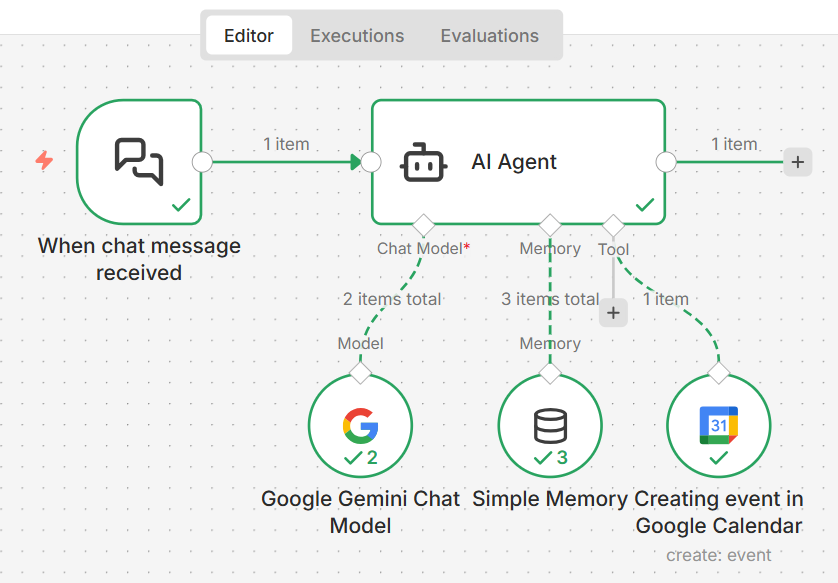

# Agentic Google Calendar Assistant using n8n

This project demonstrates an agentic AI workflow built using **n8n** that understands natural language chat messages and autonomously creates events in **Google Calendar**.

The agent extracts event details such as date, time, and description from conversational input and executes the appropriate action without requiring structured commands from the user.

---

## Overview

The goal of this project is to showcase how **agentic workflows** can be built using low code automation tools like n8n, combined with modern chat models and external tools.

The system behaves like a lightweight AI assistant that:
- Listens to user chat messages
- Understands intent and extracts event details
- Maintains short term conversational context when required
- Creates calendar events automatically

---

## Workflow Architecture

The image below shows the complete n8n workflow, including the chat trigger, AI agent, memory module, and Google Calendar tool integration.

---

## How It Works

The workflow is composed of the following components:

### 1. Chat Trigger
- Activates the workflow whenever a new chat message is received
- Acts as the entry point for user interaction

### 2. AI Agent
- Interprets the user's natural language input
- Identifies relevant event information such as title, date, and time
- Decides when and how to invoke external tools

#### Chat Model
- Uses the **Google Gemini Chat Model**, specifically **Gemini 2.5 Flash**
- Responsible for understanding, reasoning, and structuring conversational input into actionable data

#### Memory Module
- Uses n8n’s inbuilt memory storage
- Maintains a context window of the last 5 messages
- Enables more natural multi turn interactions and follow up queries

#### Tool: Google Calendar
- Uses the Google Calendar tool within n8n
- Automatically creates events in Google Calendar once details are extracted
- Ensures the API key used by the agent matches the Google Calendar account credentials
- Confirms successful event creation back to the user

## Example Interaction

The image below shows an example chat interaction where the agent understands a natural language request and creates a Google Calendar event.

